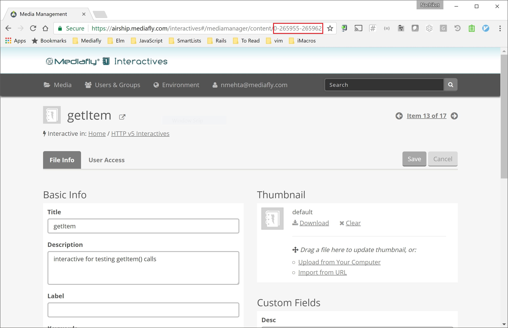

# Mediafly Extension 

## Install

### Option 1: Global install (if you are not using build tools such as gulp)

Enter the following in the terminal

	$ npm install -g @mediafly/extension-cli

Run in the folder where the Extension is located.

	$ extension-cli serve

### Option 2: Local install (if you have gulp, grunt, etc. with a static file server)

This package can also be used as a node.js middleware. You can plug in this middleware in the static file server responsible for serving up your Extension.

Enter the following in the terminal

	$ npm install @mediafly/extension-cli --save-dev

Here is an example of how to set up a [BrowserSync](http://www.browsersync.io/) server. The same can be done with any connect server as well. Here, the middleware provided by `extension-cli` can be supplied to your server.

	var browserSync = require("browser-sync")
	var options = require('./mfly-interactive.config.json')
	//Viewer slug is required here
	options.slug = '{VIEWER_SLUG}'
	var viewerMiddleware = require('@mediafly/extension-cli')(options)
		
	browserSync({
		files: 'app/**',
		https: true,
		server: {
			baseDir: './app',
			middleware: [
				viewerMiddleware
			]
		}
	})

## Initialize

1. Upload the Extension into Airship
2. Run `extension-cli init`. See [Explanation for required parameters](#explanation-for-required-parameters) for details on how to find information requested by this command.

Note: The `init` command creates `mfly-interactive.config.json` at the root of your Extension. `mfly-interactive.config.json` contains Airship user specific information. Be sure to add it to your `.gitignore` file.

**Please note that local changes to the Extension will not update the uploaded Extension. When finished making changes, you will need to upload the Extension in Airship again.**

## Testing Extension on iOS (Availability: iOS (662))

**Note: Only the Extensions that leverage the new HTTP scheme are supported.**

extension-cli can speed up testing of Extensions on iOS. Specifically it provides the following 2 features:

1. Extension will live reload in the iOS app upon file save.
2. JavaScript `console` messages from the iOS WebView will be shown in the terminal.

Steps to set this up:

1. Ensure `extension-cli serve` command is running.
2. Open the iOS app and tap `Settings > More > About` on the bottom.
3. You should see a `Select Server` dialog. Select the correct server based on your IP address.
4. Navigate to the specific Extension you are working on.
5. Open the Extension.

Now you are set to test your Extension on iOS. Turn off the debugging proxy by following the same steps above.

## Packaging an Extension

While the `publish` command will package and upload the Extension, `extension-cli` can only package the Extension as well by running:

	$ extension-cli release

## Publishing an Extension

Once you are ready to test the Extension on other platforms, or if you are ready to publish it for your users, you can publish it by using the following command.

	$ extension-cli publish

## Open Extension in Airship or Viewer

You can navigate to the Extension in Airship or Viewer by using the `open` command by running:

	extension-cli open airship
	extension-cli open viewer

## Using multiple config files (requires v1.7.1)

When you are using build tools such as Grunt, or Gulp, and compiling your single page application to a folder such as `dist`, you may not want the `mfly-interactive.config.json` file in your `dist` folder. 
This folder could be deleted and recreated during a file watch trigger that recompiles the whole app. In this case, you can put your config file in the parent folder of the `dist` folder, and point `extension-cli` at that config file.
You can supply a `--config` option to `extension-cli`.
Another use case for being able to use multiple config files is when you are managing multiple Extension uploaded in Airship (for development, staging, production, etc.)

Below are some examples:

	extension-cli serve --config ../mfly-interactive.config.json
	extension-cli publish --config ../config/mfly-interactive-prod.config.json

## Explanation for Required Parameters

- Airship User ID and Password: Credentials used to log into [https://airship.mediafly.com](airship.mediafly.com)
- Airship Item Id: This is the Id for the Extension in Airship. You can locate it by navigating to the item in Airship and extractig it from the URL. In the following example, the Airship item Id is 0-265955-265962. 
- Company Code: Company code used in Viewer.

## Reconfiguring

It is possible that the Airship Item Id or the Viewer slug of the your Extension changes. In this case, you will need to reconfigure the Extension. You can do this by runninig `extension-cli init` again.

## A note on HTTPS
Your browser will show a warning about HTTPs. Ignore this warning.
